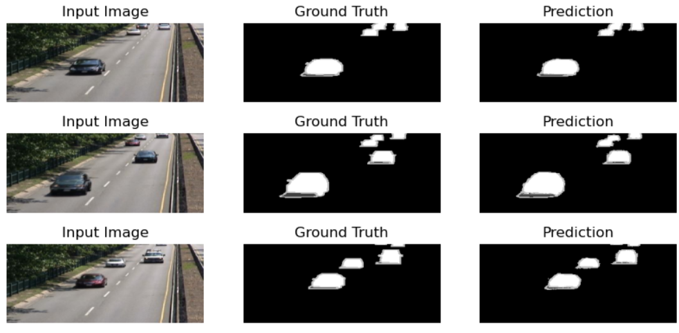
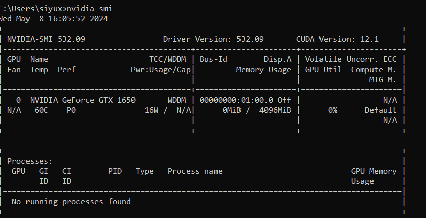
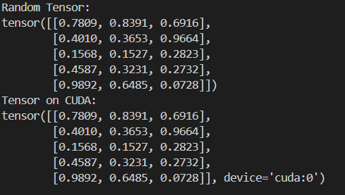

<h2 align="center">
  <a href="https://moseskonto.tu-berlin.de/moses/modultransfersystem/bolognamodule/beschreibung/anzeigen.html?nummer=40937&version=3&sprache=2 target="_blank">SoSe2024: Automatic Image Analysis</a><br/>
  TU Berlin, Computer Engineering MSc.
</h2>
<div align="center">
  
</div>

### Content 💿
Contents: visual cognition, grouping, shape descriptors, computer vision paradigm, knowledge-based image analysis, models of the real world, formal representation of the models, models in image scale space, modelling of uncertainty (softcomputing), invariant pattern recognition, Bayesian decision theorem, object detection and categorization, introduction to machine learning, deep learning, Convolutional Neural Networks, video understanding, un- and self-supervised learning, introduction to and practical experience with deep learning frameworks.

### Lab & Homework ✍️
1. Object detection/recognition: Generalized Hough Transform.
2. Maximum Likelihood Estimator.
3. Optimization procedure (residual connections, batch norm...) on:
* Clf task on FashionMNIST. Get used to pytorch.
* Denoising model with optimization on NoisyFashionMNIST.
4. Scene-Dependent Image Segmentation.

<div align="center">
  
</div>


### Installation
```bash
pip install python-opencv
```
#### pytorch
first check the NVIDIA version in cmd.
<div align="center">
  
</div>
I install <code>cuda-12.0.1.</code> <br>
Install pytorch with <code>pip3 install torch torchvision torchaudio --index-url https://download.pytorch.org/whl/cu118</code><br>
Pytorch官网上会给出指定的安装指令：<code>pip3 install torch torchvision torchaudio --index-url https://download.pytorch.org/whl/cu118</code> <br>
测试用例：

```python
import torch

#### 创建一个随机的张量
x = torch.rand(5, 3)
print("Random Tensor:")
print(x)

#### 检查CUDA是否可用，并在可用时将张量移动到GPU
if torch.cuda.is_available():
    x = x.cuda()
    print("Tensor on CUDA:")
    print(x)
```
安装成功
<div align="center">
  
</div>
